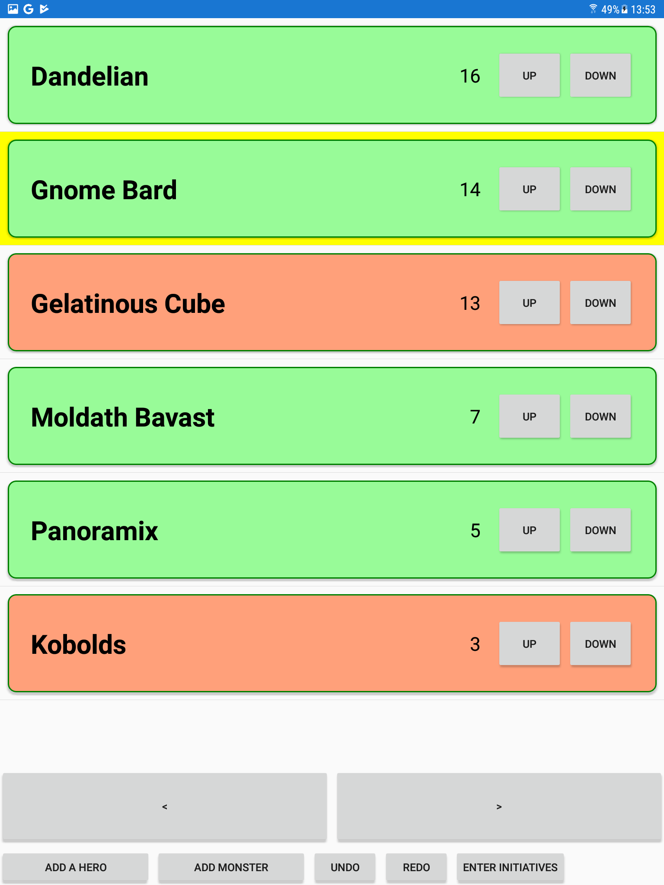

# soothsilver-initiative
A simple no-fuss initiative tracker for D&amp;D in Xamarin (Android)

* Requires the least amount of clicks of all initiative trackers 
* Supports manual entry of initiative (for all creatures at once) 
* Supports delaying/readying an action
* Remembers your party across encounters

